# Mermaid Architecture Diagrams

## Complete System Architecture


## Slot Selection Flow with Lock Ownership


## Automatic Failover & Recovery

```mermaid
stateDiagram-v2
    [*] --> RedisMode: System Start
    
    RedisMode: Redis Primary Mode
    RedisMode: ✅ <1ms operations
    RedisMode: ✅ Health key active
    
    MySQLMode: MySQL Fallback Mode
    MySQLMode: ⚠️ ~10ms operations
    MySQLMode: ⚠️ Transients used
    
    RedisMode --> HealthCheck: Every 5s
    HealthCheck --> RedisMode: Health key exists
    HealthCheck --> MySQLMode: Health key missing
    
    MySQLMode --> HealthCheck2: Every 5s
    HealthCheck2 --> MySQLMode: Still unavailable
    HealthCheck2 --> SyncMode: Redis recovered!
    
    SyncMode: Graceful Failback
    SyncMode: 🔄 Sync transients → Redis
    SyncMode: 🔄 Preserve active selections
    
    SyncMode --> RedisMode: Sync complete
    
    note right of HealthCheck
        Fast health check using
        appointease:health:ping key
        (avoids connection overhead)
    end note
    
    note right of SyncMode
        Prevents desync period
        by copying MySQL data
        back to Redis
    end note
```



## Lock Ownership Verification


## Redis Pub/Sub & Stream (Future-Proofing)


## Performance Comparison


## Data Flow Timeline


## Health Check Flow


## Graceful Failback Sync

```mermaid
flowchart TD
    A[Redis Crashes] --> B[System switches to MySQL]
    B --> C[Selections stored in transients]
    C --> D[Redis comes back online]
    D --> E{Detect recovery}
    
    E -->|Health check passes| F[Trigger sync]
    F --> G[Read MySQL transients]
    G --> H{Transients exist?}
    
    H -->|Yes| I[Copy to Redis]
    I --> J[Preserve client_id]
    J --> K[Preserve timestamps]
    K --> L[Set appropriate TTL]
    L --> M[Sync complete ✅]
    
    H -->|No| M
    M --> N[Resume Redis mode]
    
    style D fill:#51cf66
    style M fill:#51cf66
    style B fill:#ffd43b
```



## System Health Dashboard

```mermaid
graph TB
    subgraph "Monitoring Metrics"
        A[Redis Status] --> A1[● ONLINE]
        B[Storage Mode] --> B1[Redis Primary]
        C[Heartbeat] --> C1[5s interval]
        D[Active Selections] --> D1[12 slots]
        E[Locked Slots] --> E1[3 slots]
        F[Cache Hit Rate] --> F1[98.5%]
        G[Avg Response] --> G1[0.8ms]
        H[Health Check] --> H1[✅ Passing]
    end
    
    style A1 fill:#51cf66
    style B1 fill:#51cf66
    style H1 fill:#51cf66
```



## Usage Instructions

### Rendering Mermaid Diagrams

**In GitHub/GitLab:**
- Diagrams render automatically in markdown files

**In Documentation Sites:**
```html
<script src="https://cdn.jsdelivr.net/npm/mermaid/dist/mermaid.min.js"></script>
<script>mermaid.initialize({startOnLoad:true});</script>
```

**In VS Code:**
- Install "Markdown Preview Mermaid Support" extension
- Preview with `Ctrl+Shift+V`

**Online Editor:**
- https://mermaid.live/
- Copy/paste diagrams for editing and export

### Export Options

1. **PNG/SVG**: Use mermaid.live editor
2. **PDF**: Print from browser with diagrams rendered
3. **Embed**: Use mermaid CDN in HTML docs

These diagrams provide visual clarity for developers, DevOps, and stakeholders!
